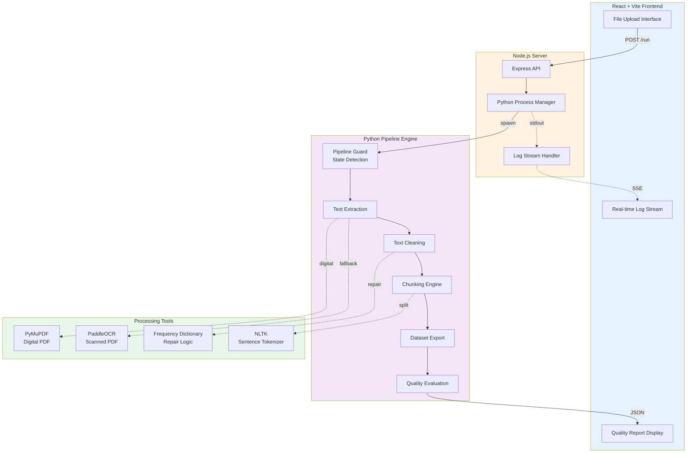
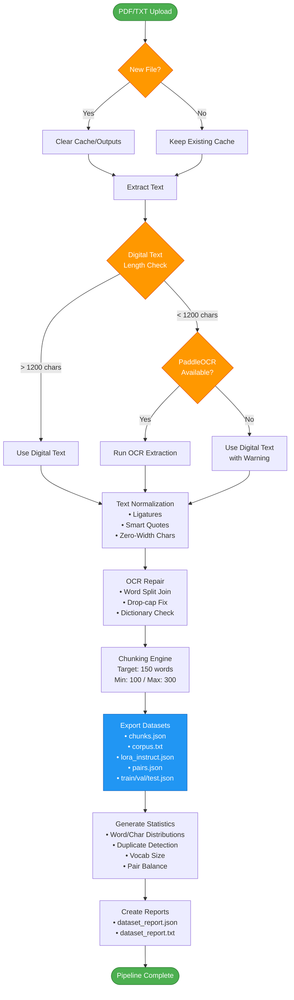

# Dataset Pipeline Pro
Dataset Pipeline Pro that converts PDFs / text into clean, chunked, training-ready datasets for BERT, LoRA, QLoRA, and semantic pair training. Includes OCR fallback, noise cleaning, chunking, multi-format dataset export, and automatic evaluation reports.
### DIRECT LIVE LINK TEST HERE
---
https://huggingface.co/spaces/AI-Solutions-KK/dataset-pipeline-pro

---


---
The system combines a Node.js orchestration server with a Python processing engine to deliver deterministic, reproducible dataset generation with validation metrics and structured exports.

---

## What It Does

Dataset Pipeline Pro transforms unstructured technical documents into structured ML-ready datasets by:

- Extracting text from PDF and TXT sources
- Automatically falling back to OCR when digital text is weak (<1200 chars)
- Normalizing noisy text artifacts and encoding issues
- Repairing OCR word splits and drop-cap errors using dictionary logic
- Performing safe linguistic cleaning (non-destructive)
- Generating optimized text chunks with configurable targets
- Exporting multiple dataset formats (BERT, LoRA, pairs, splits)
- Producing evaluation and quality reports

Outputs are suitable for:

- BERT-style MLM training
- LoRA / QLoRA fine-tuning
- Embedding model training
- Semantic similarity pair datasets
- RAG dataset preparation

---

## What Makes It Unique

**Deterministic Cleaning Pipeline**
- Safe text normalization without destructive merges
- Dictionary-guided join/split repair with frequency thresholds
- Drop-cap sentence repair using pattern detection
- Boundary protection rules (no mid-word splits)

**Dual Extraction Strategy**
- Fast block-ordered digital PDF extraction via PyMuPDF
- Automatic PaddleOCR fallback when digital text < 1200 chars
- Block-level Y/X coordinate sorting for layout correctness

**Model-Agnostic Output**
- Not tied to a specific model or tokenizer
- Produces neutral, reusable training chunks
- Configurable chunking targets (150-word default, 100-min, 300-max)

**Quality-Aware Processing**
- Chunk statistics (word/char distributions)
- Duplicate detection
- Vocabulary size estimation
- Positive/negative pair balance
- Train/val/test split metrics (80/10/10)

**Hybrid Architecture**
- Node.js control plane with Express server
- Python processing engine with real-time log streaming
- State-based pipeline guard (auto-cleanup on new files)

---

## System Architecture



---

## Processing Pipeline Flow



---

## Core Processing Stages

### 1. Extraction
- **PyMuPDF block extraction**: Ordered by Y-coordinate (top → bottom), then X-coordinate (left → right)
- **OCR fallback trigger**: Digital text < 1200 characters
- **PaddleOCR**: Word-level extraction with confidence filtering (> 0.6)

### 2. Normalization
- Ligature replacement (`fi` → `fi`, `ff` → `ff`)
- Smart quote normalization (`"` → `"`, `'` → `'`)
- Zero-width character removal
- Whitespace collapsing

### 3. Repair
- **OCR split-word join**: Dictionary-guided (requires both parts absent & combined form present with freq > 100)
- **Drop-cap fix**: Pattern-based detection (single capital + sentence fragment)
- **Boundary protection**: No mid-word splits

### 4. Chunking
- **Target size**: 150 words
- **Min/max bounds**: 100 / 300 words
- **NLTK sentence tokenizer**: Preserves sentence boundaries
- **Smart overflow**: Adds partial sentences if within max bound

### 5. Export
- `chunks.json` — Raw chunk array
- `chunks_with_id.json` — ID + text + word_count
- `corpus.txt` — BERT MLM format (chunks separated by `\n\n`)
- `lora_instruct.json` — Instruction-tuning format
- `pairs.json` — Positive (sequential) + negative (random) pairs
- `train.json` / `val.json` / `test.json` — 80/10/10 split

### 6. Evaluation
- Chunk statistics (word count: min/max/mean/median)
- Character count distributions
- Short chunk detection (< 80 words)
- Duplicate chunk count
- Vocabulary size estimate
- Pair label balance (positive vs negative)

---

## Design Goals

✅ **Non-destructive cleaning** — No aggressive text merges or guesses  
✅ **Reproducible dataset generation** — Deterministic pipeline with state tracking  
✅ **Model-agnostic outputs** — No tokenizer dependencies  
✅ **Safe OCR repair** — Dictionary-backed with conservative thresholds  
✅ **Transparent processing** — Real-time log streaming to UI  
✅ **Minimal heuristic risk** — Prefer explicit rules over ML-based guesses  

---

## Tech Stack

| Layer | Technology |
|-------|-----------|
| **Frontend** | React + Vite |
| **Backend** | Node.js + Express |
| **Processing Engine** | Python 3.8+ |
| **PDF Parsing** | PyMuPDF (fitz) |
| **OCR** | PaddleOCR |
| **Text Processing** | NLTK (sentence tokenizer) |
| **Dictionary Repair** | Frequency-based word validation |
| **State Management** | JSON-based pipeline guard |

---

## File Structure

```
project/
├── data/              # (Optional) Source file staging
├── cache/             # Pipeline state + intermediate artifacts
├── datasets/          # Exported datasets (JSON, TXT)
├── outputs/           # Quality reports (JSON, TXT)
├── src/
│   ├── server.js      # Node.js orchestration server
│   └── pipeline_engine.py  # Python processing engine
└── README.md
```

---

## Pipeline State Logic

The pipeline uses a **state guard** to detect file changes:

1. **New file detected** → Clears `cache/`, `datasets/`, `outputs/`
2. **Same file re-run** → Preserves existing outputs (no re-processing)
3. **State tracking** → JSON file at `cache/pipeline_state.json`

---

## Frequency Dictionary Repair

**Word split join logic**:
```python
# Example: "com puter" → "computer"
if word1 not in dictionary and \
   word2 not in dictionary and \
   (word1 + word2) in dictionary and \
   frequency(word1 + word2) > 100:
    return word1 + word2
```

**Drop-cap repair logic**:
```python
# Example: "T he cat sat" → "The cat sat"
if len(first_word) == 1 and first_word.isupper():
    if len(sentence.split()) >= 2:
        return first_word + second_word + " " + rest
```

---

## Quality Metrics

The evaluation report includes:

- **Total chunks** — Number of dataset records
- **Word stats** — Min/max/mean/median words per chunk
- **Char stats** — Character distribution metrics
- **Short chunks** — Count of chunks < 80 words
- **Duplicates** — Exact duplicate chunk count
- **Vocab size** — Unique word count estimate
- **Pair balance** — Positive vs negative pair counts
- **Split sizes** — Train/val/test record counts

---

## Log Streaming

Real-time logs are streamed via:
1. Python `print()` with `flush=True`
2. Node.js `child_process.spawn()` stdout capture
3. Server-Sent Events (SSE) to frontend

Log format: `LOG: [STAGE] message`

---

## Exit Codes

- `0` — Pipeline success
- `1` — Pipeline error (file not found, extraction failed, etc.)

---

## License

apache
